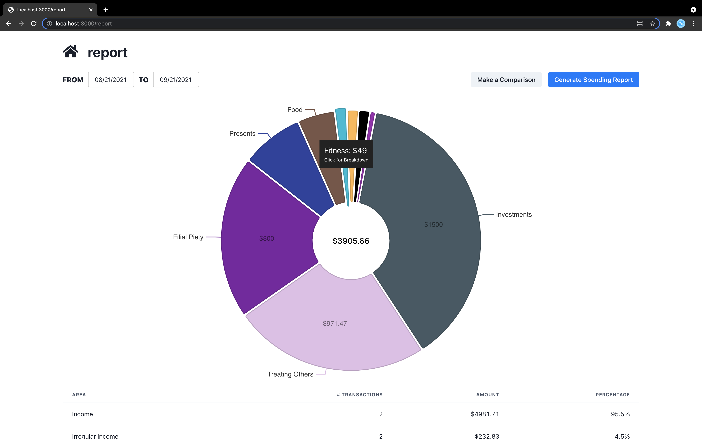
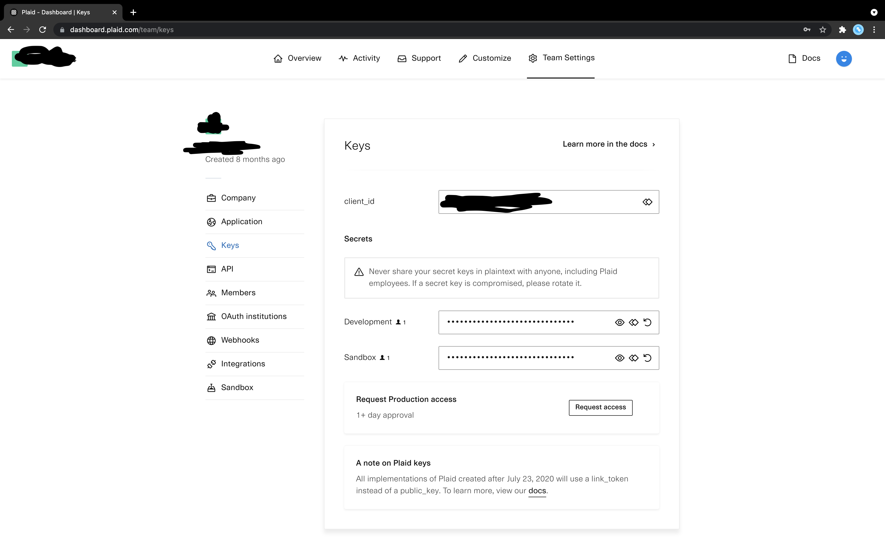
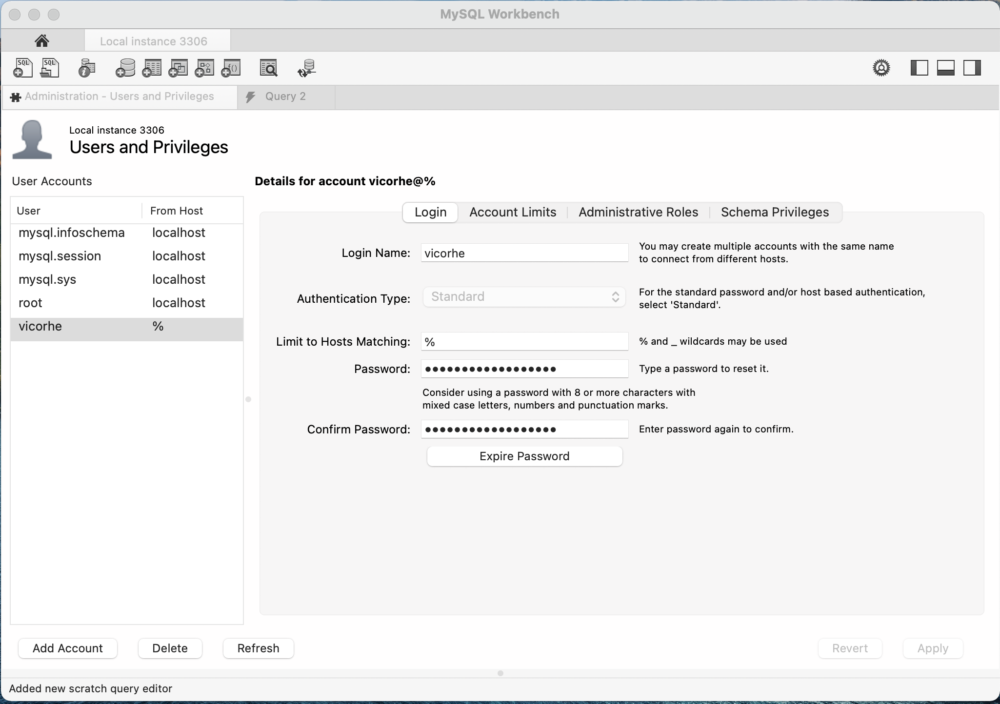
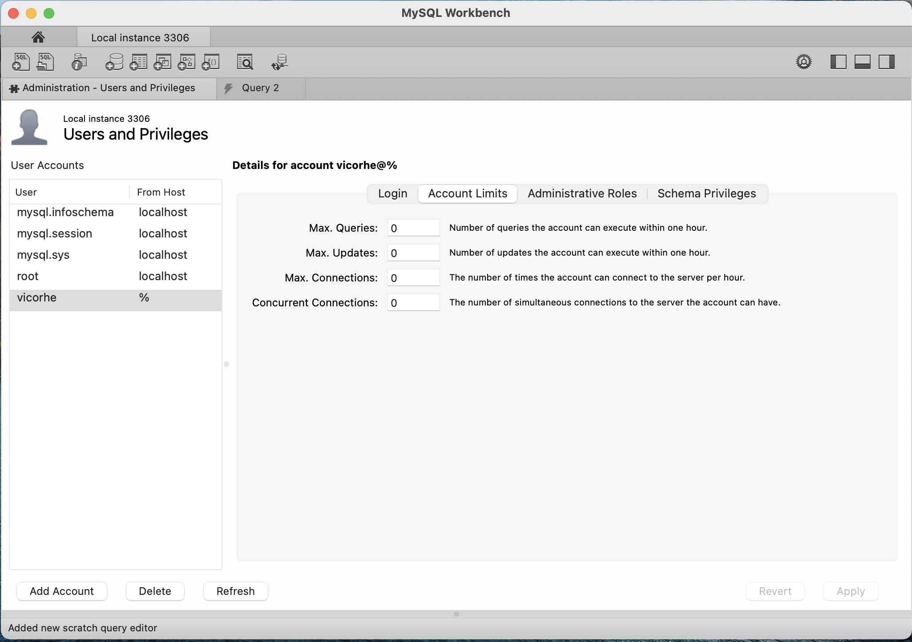
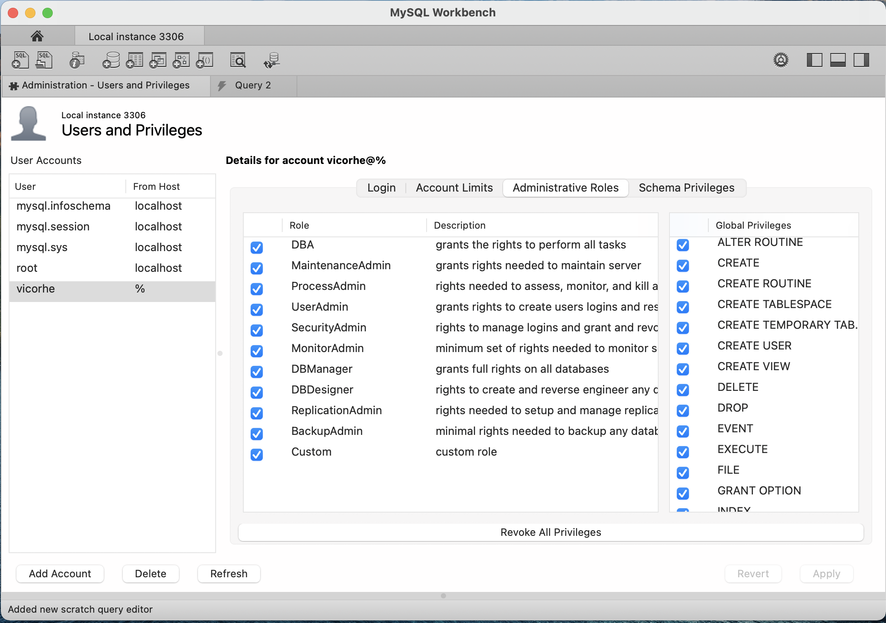
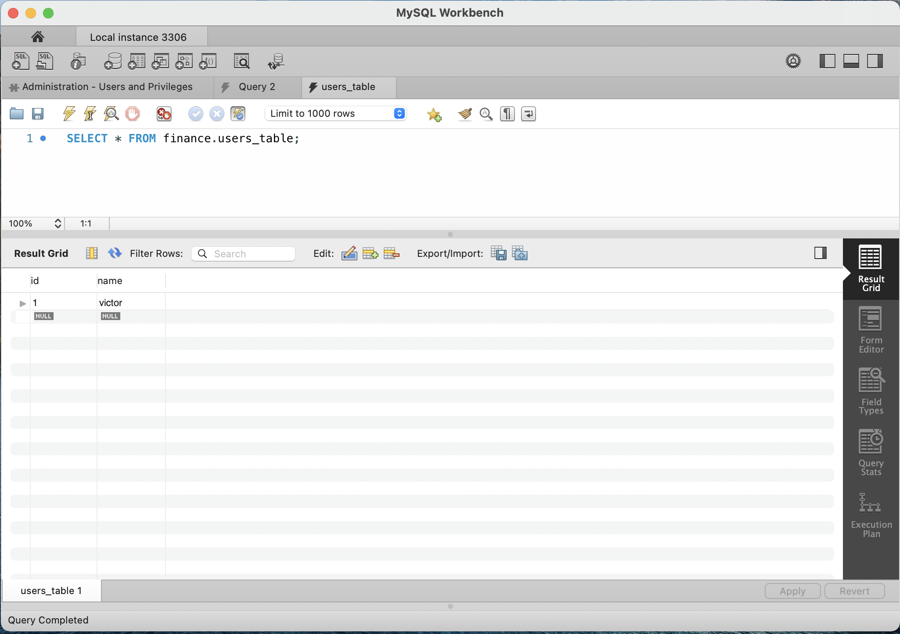

# Finance Tracker
This is a personal finance tracking application. 
It leverages Plaid to pull transactions from financial institutions.


## Prequisites
You might not need the version listed, those are just the versions that work for me.
* [Plaid](https://dashboard.plaid.com/signup) 
* [Node](https://nodejs.org/en/) (16.9.1)
* [MySQL](https://dev.mysql.com/downloads/mysql/) (8.0.26)
* [MySQL Workbench](https://dev.mysql.com/downloads/workbench/) - optional (8.0.26)

## Create a Plaid Developer Account


## Set Up MySQL Workbench
* Create a schema.
* Import SQL table structure from structure dump file `setup/tablestructure.sql`.

## Create a Dedicated User to Access SQL Client
* Grant this user the administrative role of DBA.




## Create a user in the users_table
* Set an ID and a name.


## Set Environment Variables
Make a copy of `setup/.env.local.example` and rename it to `.env.local`.

Place this file in the root directory of the project.
### Fill in environment variables:
* MYSQL_DATABASE - name of schema
* MYSQL_USERNAME - name of user to access db client
* MYSQL_PASSWORD 
* PLAID_CLIENT_ID
* PLAID_SECRET_DEVELOPMENT
* PLAID_SECRET_SANDBOX
* NEXT_PUBLIC_USER_ID - user id of the your user in users_table
* NEXT_PUBLIC_USER_NAME - user name of your user in users_table

## Run Locally
```bash
npm i
npm run dev
```

